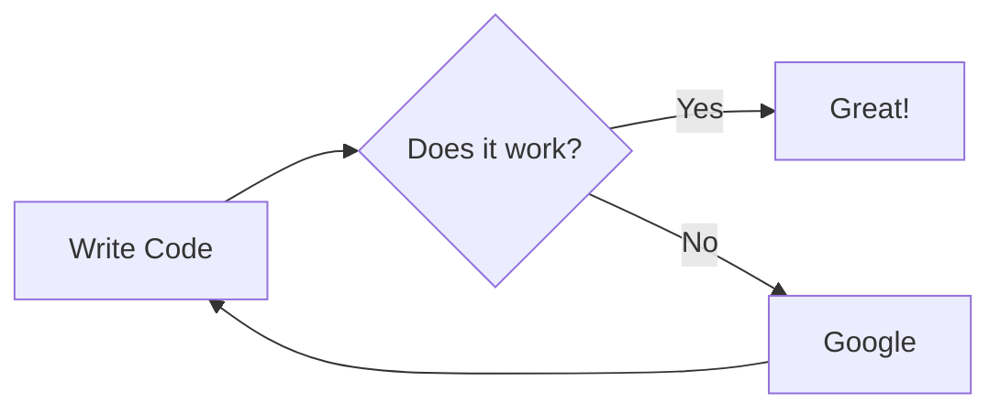
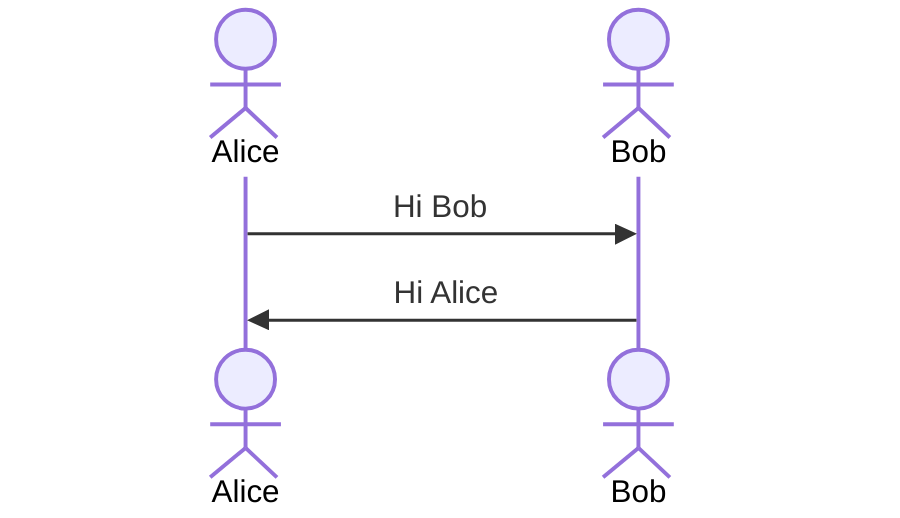
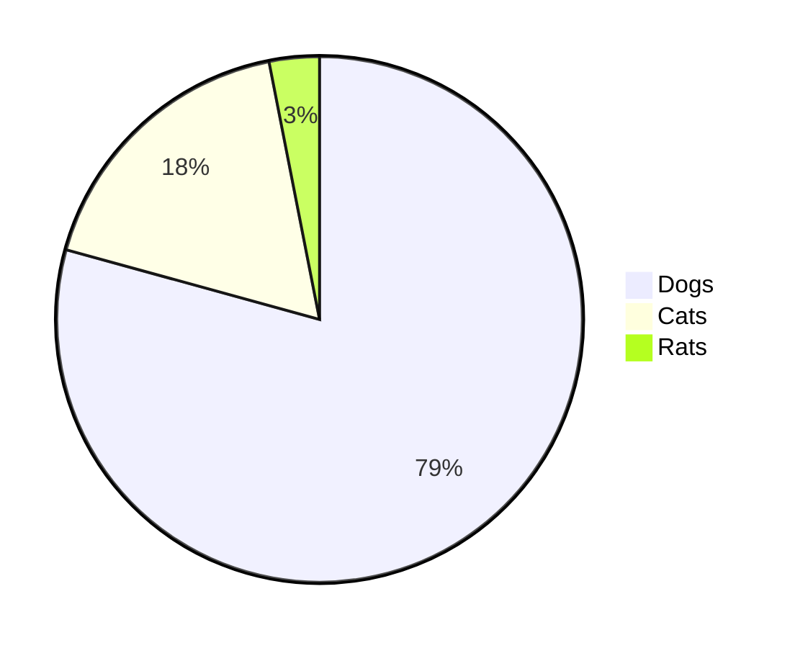
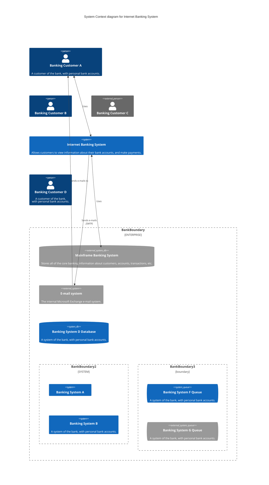
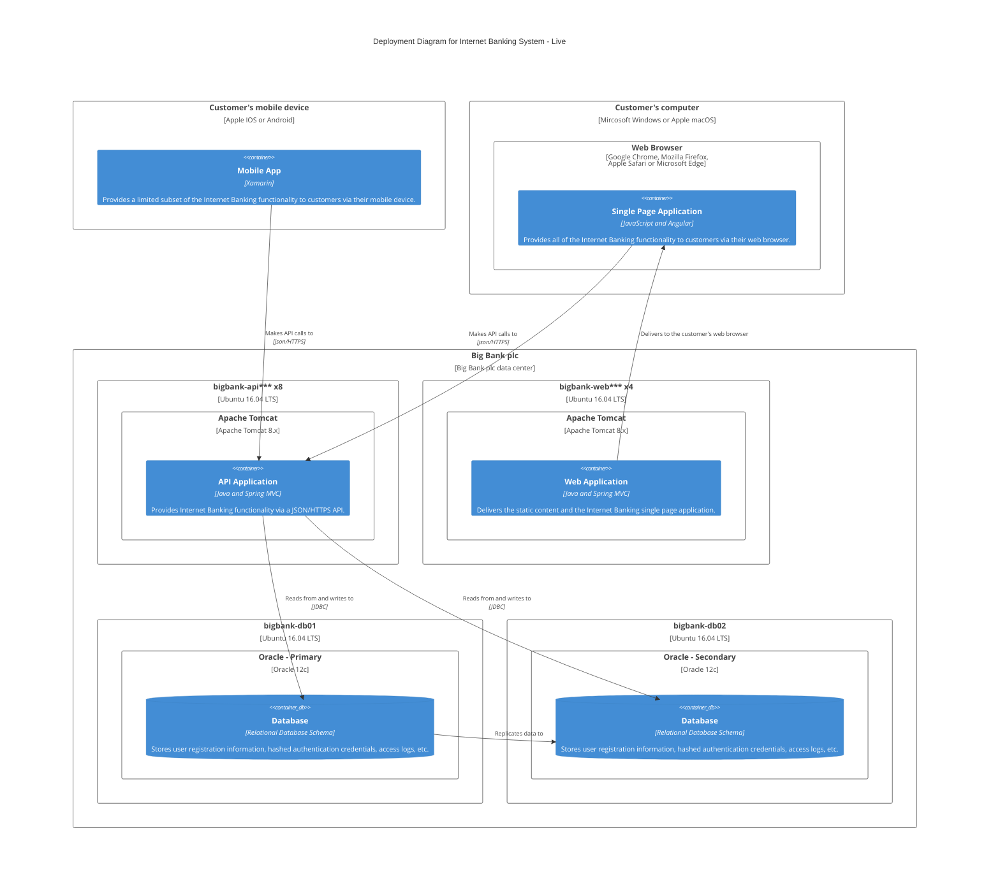

# test_plant_uml_mermaid

# Markdown

Test rendering Mermaid.js







### C4




### PlantUML

```puml
    C4Context
      title System Context diagram for Internet Banking System
      Enterprise_Boundary(b0, "BankBoundary0") {
        Person(customerA, "Banking Customer A", "A customer of the bank, with personal bank accounts.")
        Person(customerB, "Banking Customer B")      
        Person_Ext(customerC, "Banking Customer C", "desc")            

        Person(customerD, "Banking Customer D", "A customer of the bank, <br/> with personal bank accounts.")

        System(SystemAA, "Internet Banking System", "Allows customers to view information about their bank accounts, and make payments.")  

        Enterprise_Boundary(b1, "BankBoundary") {
         
          SystemDb_Ext(SystemE, "Mainframe Banking System", "Stores all of the core banking information about customers, accounts, transactions, etc.")      

          System_Boundary(b2, "BankBoundary2") {  
            System(SystemA, "Banking System A")  
            System(SystemB, "Banking System B", "A system of the bank, with personal bank accounts. next line.")        
          } 

          System_Ext(SystemC, "E-mail system", "The internal Microsoft Exchange e-mail system.") 
          SystemDb(SystemD, "Banking System D Database", "A system of the bank, with personal bank accounts.") 

          Boundary(b3, "BankBoundary3", "boundary") {  
            SystemQueue(SystemF, "Banking System F Queue", "A system of the bank.")        
            SystemQueue_Ext(SystemG, "Banking System G Queue", "A system of the bank, with personal bank accounts.") 
          }
        }
      }
      
      BiRel(customerA, SystemAA, "Uses")
      BiRel(SystemAA, SystemE, "Uses")
      Rel(SystemAA, SystemC, "Sends e-mails", "SMTP")
      Rel(SystemC, customerA, "Sends e-mails to")

      UpdateElementStyle(customerA, $fontColor="red", $bgColor="grey", $borderColor="red")
      UpdateRelStyle(customerA, SystemAA, $textColor="blue", $lineColor="blue", $offsetX="5")
      UpdateRelStyle(SystemAA, SystemE, $textColor="blue", $lineColor="blue", $offsetY="-10")
      UpdateRelStyle(SystemAA, SystemC, $textColor="blue", $lineColor="blue", $offsetY="-40", $offsetX="-50")
      UpdateRelStyle(SystemC, customerA, $textColor="red", $lineColor="red", $offsetX="-50", $offsetY="20")
      
      UpdateLayoutConfig($c4ShapeInRow="3", $c4BoundaryInRow="1")
```

```puml
@startuml
!include https://raw.githubusercontent.com/plantuml-stdlib/C4-PlantUML/master/C4_Context.puml

'LAYOUT_WITH_LEGEND

title System Context diagram for Threat Lab

Boundary(AWN, "Arctic Wolf"){
    Boundary(AWL, "AWLabs"){
        Person(SR_User, Threat Researcher, "Threat researcher in SIA")
        Boundary(ThreatLab, "Threat Lab"){
            System(DetectionEnvironment, "Detection Environment")
            System(BASFramework, "BAS Framework")
        }
        System_Ext(TIP, "Threat Intelligence Platform")
    }
    System_Ext(vxIntel, "Malware Repository")
    System_Ext(IPA, "Detections Pipeline")
}
System_Ext(AttackIQ, "AttackIQ")

Rel_R(vxIntel, DetectionEnvironment, "Malware samples", "sftp")
Rel_R(BASFramework, AttackIQ,  "Scenarios to Execute", "REST API")
Rel_D(BASFramework, DetectionEnvironment, "Orchestrate Resources", "VMWare Cloud")
Rel_L(BASFramework, TIP, "IOC/TTPs", "STIX")
Rel_L(AttackIQ, DetectionEnvironment, "Attack Scenarios", "AttackIQ Agent")
Rel_U(TIP, SR_User, "Malware IOC/TTPs", "TIP GUI")
Rel_L(TIP, IPA, "IOC/TTP-based detections", "Crules")
Rel_D(SR_User, TIP, "Validates IOC/TTPs for detections", "TIP GUI")

@enduml
```
